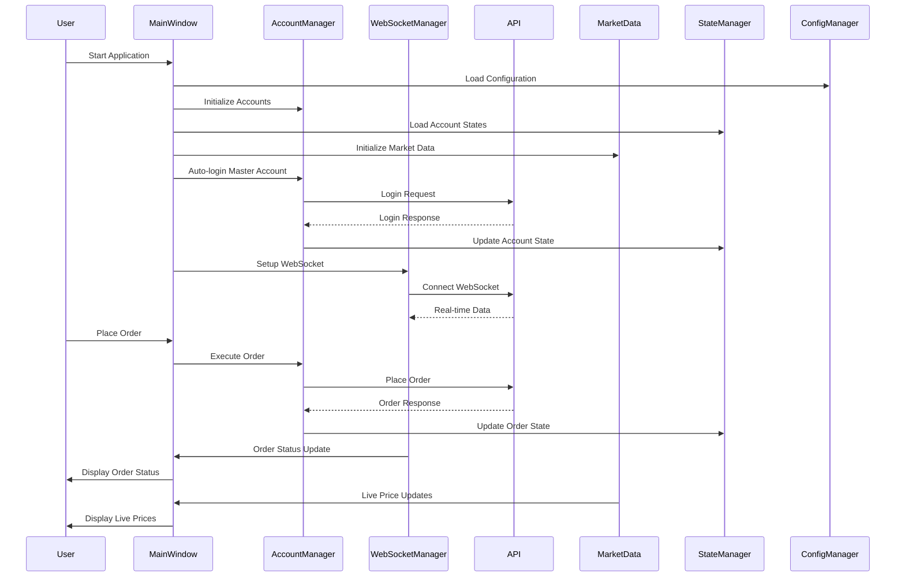
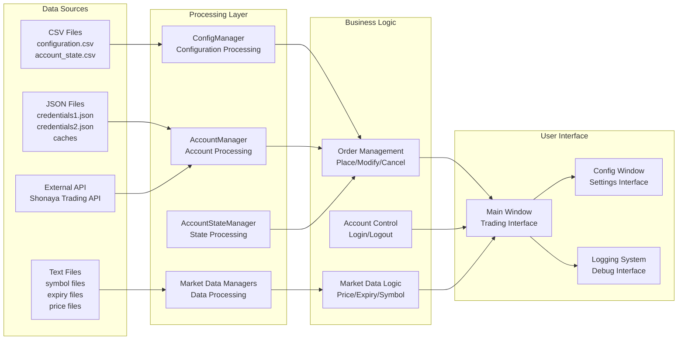
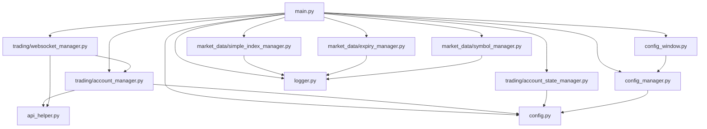
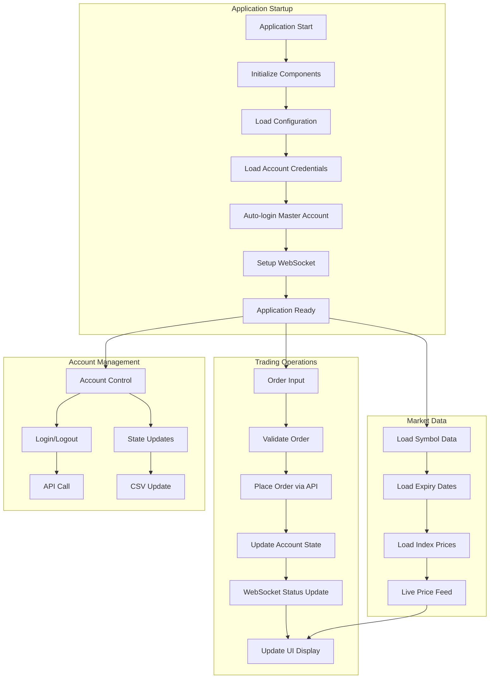

# MasterChild_GUI Trading Application - Flow Diagram

## System Architecture Overview

```mermaid
graph TB
    %% Main Application Entry Point
    MAIN[main.py - MainWindow Class] --> CONFIG[ConfigManager]
    MAIN --> ACCOUNT_MGR[AccountManager]
    MAIN --> STATE_MGR[AccountStateManager]
    MAIN --> WS_MGR[WebSocketManager]
    MAIN --> INDEX_MGR[SimpleIndexManager]
    MAIN --> EXPIRY_MGR[ExpiryManager]
    MAIN --> SYMBOL_MGR[SymbolManager]
    
    %% Configuration Layer
    CONFIG --> CONFIG_CSV[configuration.csv]
    CONFIG --> CONFIG_WINDOW[ConfigWindow]
    
    %% Account Management
    ACCOUNT_MGR --> API[api_helper.py - ShoonyaApiPy]
    ACCOUNT_MGR --> CREDS1[credentials1.json]
    ACCOUNT_MGR --> CREDS2[credentials2.json]
    ACCOUNT_MGR --> CONFIG_CLASS[config.py - Config]
    
    %% State Management
    STATE_MGR --> ACCOUNT_CSV[account_state.csv]
    
    %% Market Data Layer
    INDEX_MGR --> INDEX_CACHE[index_prices_cache.json]
    INDEX_MGR --> INDEX_TXT[index_prices.txt]
    
    EXPIRY_MGR --> EXPIRY_CACHE[expiry_cache.json]
    EXPIRY_MGR --> NF_EXPIRY[nf_expiry_dates.txt]
    EXPIRY_MGR --> BN_EXPIRY[bn_expiry_dates.txt]
    EXPIRY_MGR --> SX_EXPIRY[sx_expiry_dates.txt]
    
    SYMBOL_MGR --> NFO_SYMBOLS[NFO_symbols.txt_*.txt]
    SYMBOL_MGR --> BFO_SYMBOLS[BFO_symbols.txt_*.txt]
    
    %% WebSocket Layer
    WS_MGR --> ACCOUNT_MGR
    WS_MGR --> LOGGER[logger.py]
    
    %% Logging System
    LOGGER --> LOGS[logs/ directory]
    LOGS --> APP_LOGS[app_*.log]
    LOGS --> WS_LOGS[Log_*_WS_*.log]
    LOGS --> APPLICATION_LOGS[applicationLogger_*.log]
    
    %% External API
    API --> SHOOYA_API[Shonaya Trading API]
    
    %% Data Flow
    MAIN --> GUI[GUI Components]
    GUI --> ORDER_PLACEMENT[Order Placement]
    GUI --> ACCOUNT_CONTROL[Account Control]
    GUI --> MARKET_DATA_DISPLAY[Market Data Display]
    
    %% Order Flow
    ORDER_PLACEMENT --> ACCOUNT_MGR
    ACCOUNT_MGR --> API
    API --> SHOOYA_API
    SHOOYA_API --> WS_MGR
    WS_MGR --> ORDER_UPDATES[Order Status Updates]
    ORDER_UPDATES --> GUI
    
    %% Market Data Flow
    INDEX_MGR --> LIVE_PRICES[Live Index Prices]
    EXPIRY_MGR --> EXPIRY_DATES[Expiry Dates]
    SYMBOL_MGR --> SYMBOL_DATA[Symbol Information]
    LIVE_PRICES --> GUI
    EXPIRY_DATES --> GUI
    SYMBOL_DATA --> GUI
```



## Detailed Component Flow



## Data Flow Architecture



## Module Dependencies



## Key Features Flow



## File Structure Overview

```
MasterChild_GUI/
├── main.py                          # Main application entry point
├── config.py                        # Configuration constants
├── config_manager.py                # Configuration management
├── config_window.py                 # Configuration UI
├── api_helper.py                    # Trading API wrapper
├── logger.py                        # Logging system
├── account_state.csv                # Account state persistence
├── configuration.csv                # Application configuration
├── credentials1.json                # Master account credentials
├── credentials2.json                # Child account credentials
├── trading/                         # Trading modules
│   ├── account_manager.py           # Account management
│   ├── account_state_manager.py     # State management
│   └── websocket_manager.py         # Real-time data
├── market_data/                     # Market data modules
│   ├── simple_index_manager.py      # Index price management
│   ├── expiry_manager.py            # Expiry date management
│   └── symbol_manager.py            # Symbol data management
├── data/                            # Data files
│   ├── NFO_symbols.txt_*.txt        # NFO symbol data
│   ├── BFO_symbols.txt_*.txt        # BFO symbol data
│   ├── nf_expiry_dates.txt          # NIFTY expiry dates
│   ├── bn_expiry_dates.txt          # BANKNIFTY expiry dates
│   ├── sx_expiry_dates.txt          # SENSEX expiry dates
│   ├── index_prices.txt             # Index prices
│   ├── index_prices_cache.json      # Price cache
│   └── expiry_cache.json            # Expiry cache
└── logs/                            # Log files
    ├── app_*.log                    # Application logs
    ├── Log_*_WS_*.log               # WebSocket logs
    └── applicationLogger_*.log      # General logs
```

## Key Components Description

### 1. **MainWindow (main.py)**
- Central GUI controller
- Manages all UI components
- Coordinates between all modules
- Handles user interactions

### 2. **AccountManager (trading/account_manager.py)**
- Manages multiple trading accounts
- Handles login/logout operations
- Manages API connections
- Coordinates with WebSocket manager

### 3. **AccountStateManager (trading/account_state_manager.py)**
- Tracks account states (logged in/out, order status)
- Persists state to CSV file
- Provides state queries and updates

### 4. **WebSocketManager (trading/websocket_manager.py)**
- Manages real-time data connections
- Handles order status updates
- Processes live price feeds
- Manages callbacks for UI updates

### 5. **Market Data Managers**
- **SimpleIndexManager**: Manages NIFTY, BANKNIFTY, SENSEX prices
- **ExpiryManager**: Handles option expiry date calculations
- **SymbolManager**: Manages symbol data and market information

### 6. **Configuration System**
- **ConfigManager**: Loads and manages configuration settings
- **ConfigWindow**: Provides UI for configuration editing
- **config.py**: Defines application constants

### 7. **API Integration (api_helper.py)**
- Wraps Shonaya Trading API
- Handles order placement and management
- Manages WebSocket connections

### 8. **Logging System (logger.py)**
- Centralized logging configuration
- Separate loggers for different components
- Daily log file rotation

This architecture provides a robust, modular trading application with clear separation of concerns and comprehensive data management capabilities.
