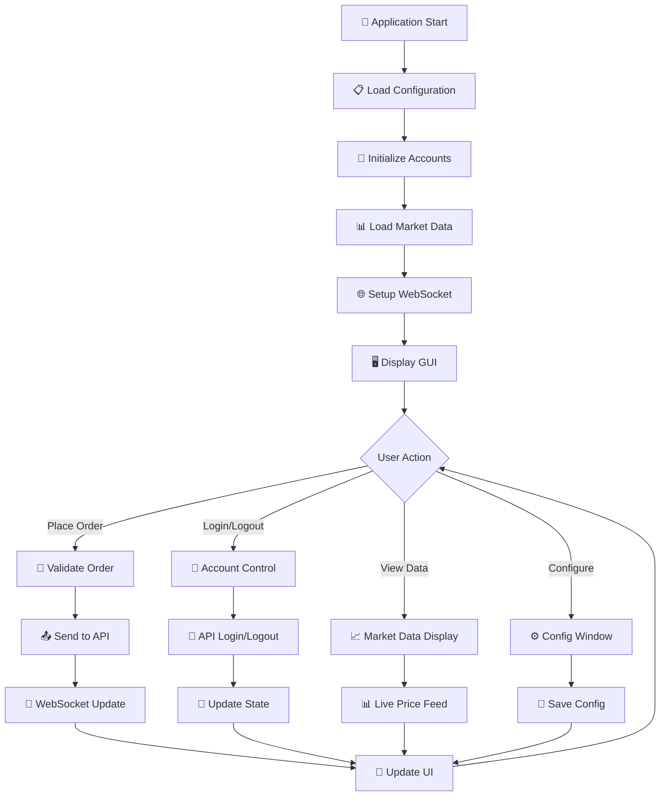
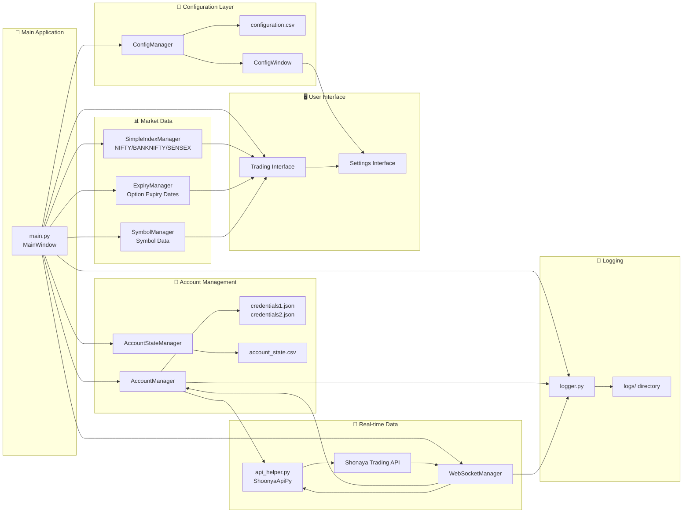
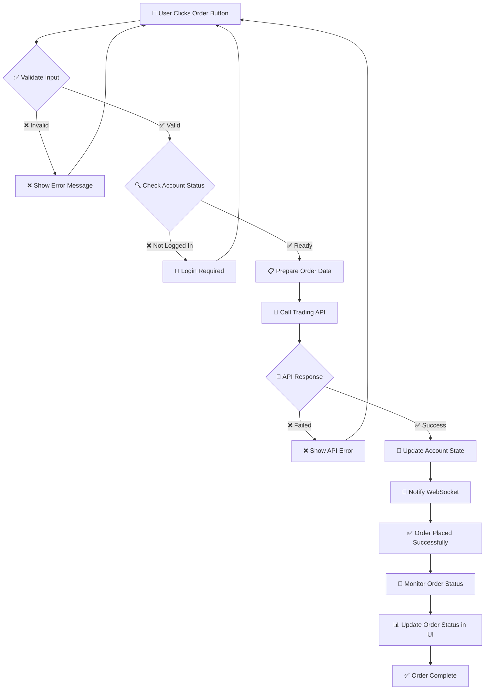
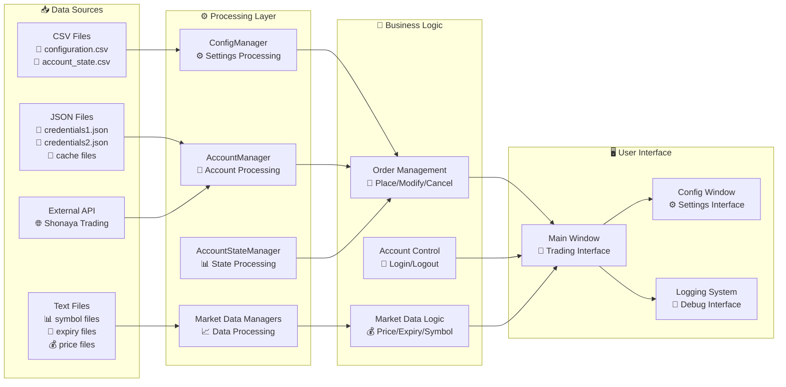
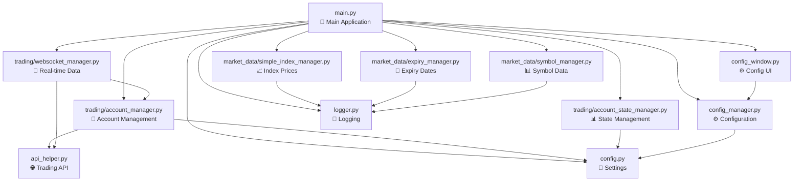
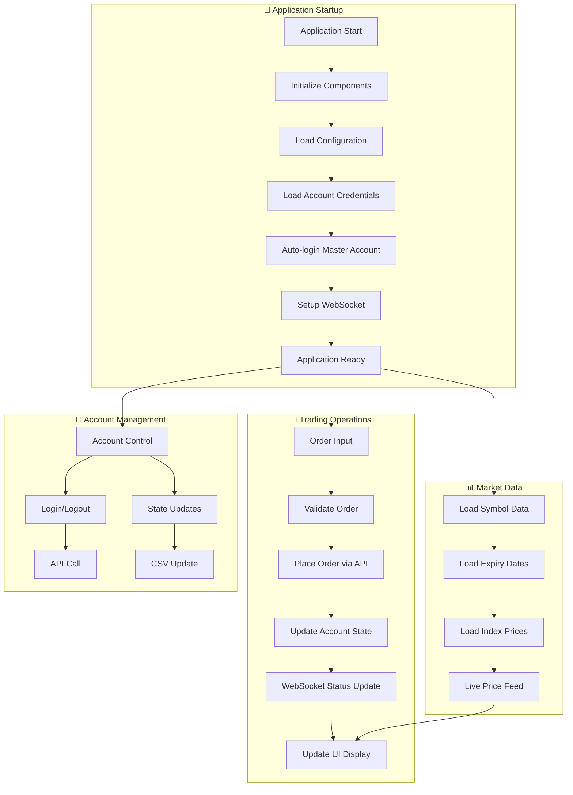

# MasterChild_GUI Trading Application - Visual Flow Chart

## Main Application Flow

## System Architecture Flow

## Trading Order Flow

## Data Flow Architecture

## Module Dependencies Flow

## Key Features Flow

## File Structure Visual

```mermaid
flowchart TD
    ROOT[📁 MasterChild_GUI/] --> MAIN[📄 main.py<br/>🎯 Main Application]
    ROOT --> CONFIG[📄 config.py<br/>⚙️ Configuration]
    ROOT --> CONFIG_MGR[📄 config_manager.py<br/>🔧 Config Management]
    ROOT --> CONFIG_WIN[📄 config_window.py<br/>⚙️ Config UI]
    ROOT --> API[📄 api_helper.py<br/>🌐 Trading API]
    ROOT --> LOGGER[📄 logger.py<br/>📝 Logging]
    ROOT --> CSV[📄 account_state.csv<br/>📊 Account States]
    ROOT --> CONFIG_CSV[📄 configuration.csv<br/>⚙️ Settings]
    ROOT --> CREDS1[📄 credentials1.json<br/>🔐 Master Account]
    ROOT --> CREDS2[📄 credentials2.json<br/>🔐 Child Account]
    
    ROOT --> TRADING[📁 trading/]
    TRADING --> ACC_MGR[📄 account_manager.py<br/>👥 Account Management]
    TRADING --> STATE_MGR[📄 account_state_manager.py<br/>📊 State Management]
    TRADING --> WS_MGR[📄 websocket_manager.py<br/>📡 Real-time Data]
    
    ROOT --> MARKET[📁 market_data/]
    MARKET --> INDEX_MGR[📄 simple_index_manager.py<br/>📈 Index Prices]
    MARKET --> EXPIRY_MGR[📄 expiry_manager.py<br/>📅 Expiry Dates]
    MARKET --> SYMBOL_MGR[📄 symbol_manager.py<br/>📊 Symbol Data]
    
    ROOT --> DATA[📁 data/]
    DATA --> NFO[📄 NFO_symbols.txt_*.txt<br/>📊 NFO Symbols]
    DATA --> BFO[📄 BFO_symbols.txt_*.txt<br/>📊 BFO Symbols]
    DATA --> EXPIRY_FILES[📄 *_expiry_dates.txt<br/>📅 Expiry Dates]
    DATA --> PRICE_FILES[📄 index_prices*.txt<br/>💰 Price Data]
    DATA --> CACHE[📄 *_cache.json<br/>💾 Cache Files]
    
    ROOT --> LOGS[📁 logs/]
    LOGS --> APP_LOGS[📄 app_*.log<br/>📝 Application Logs]
    LOGS --> WS_LOGS[📄 Log_*_WS_*.log<br/>📡 WebSocket Logs]
    LOGS --> GENERAL_LOGS[📄 applicationLogger_*.log<br/>📝 General Logs]
```

This visual flowchart shows the complete flow of your MasterChild_GUI trading application with clear visual indicators and emojis to make it easy to understand the relationships between different components!
