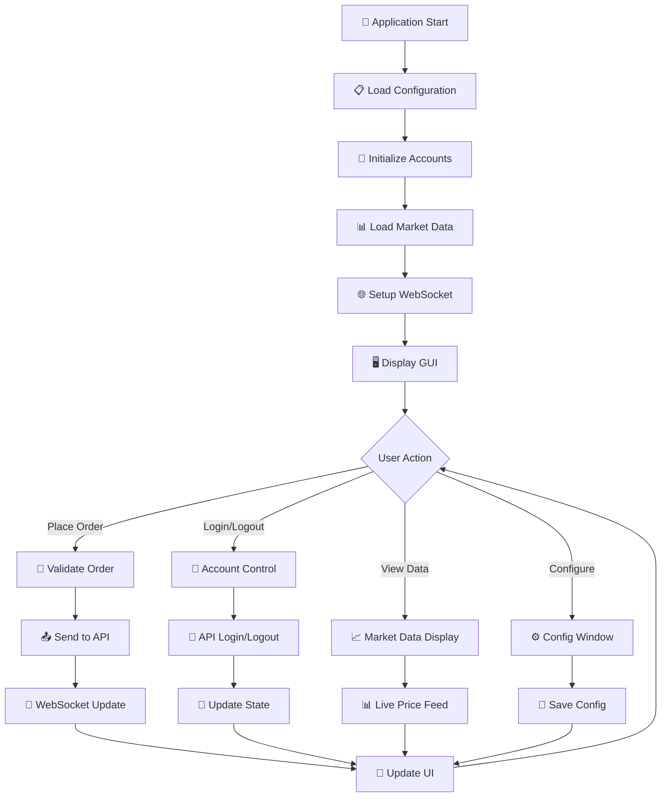
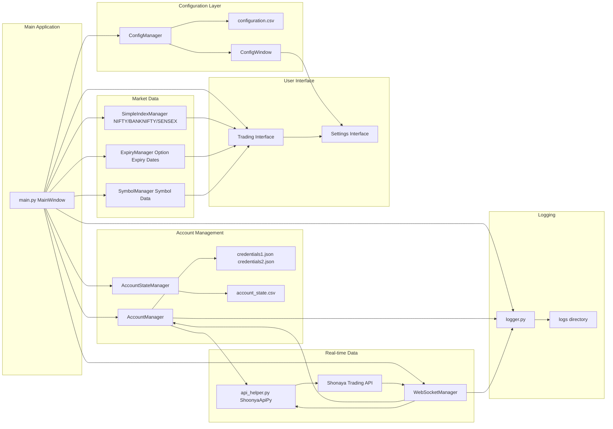
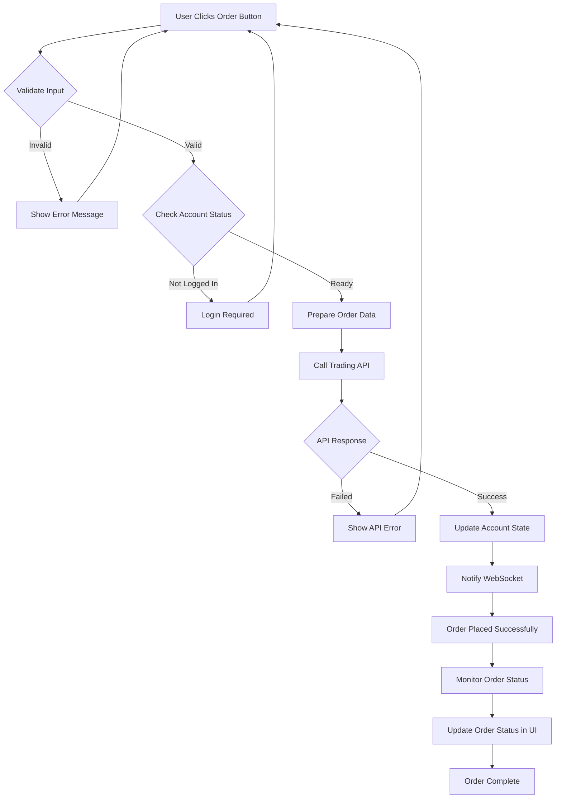
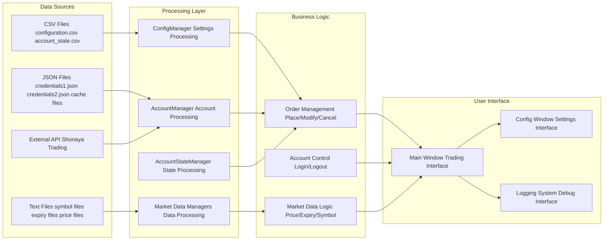
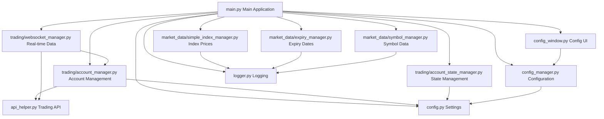
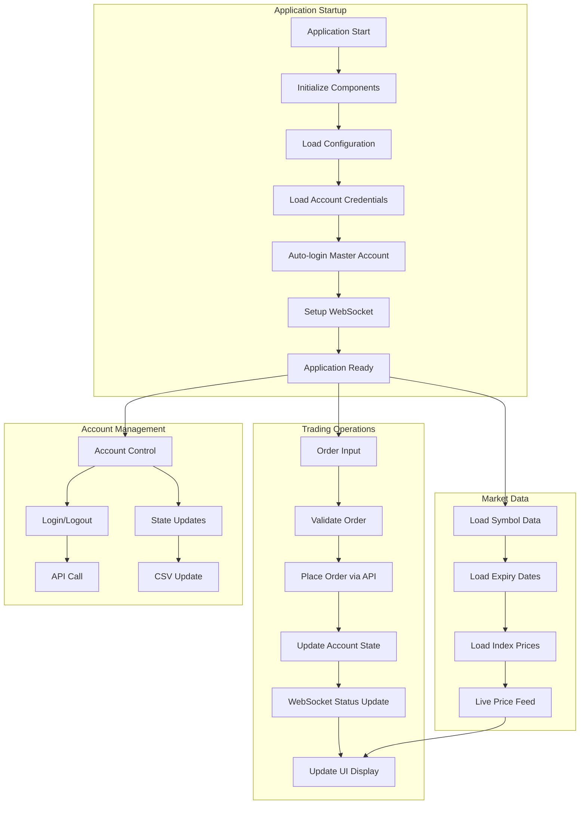

# MasterChild_GUI Trading Application - Visual Flow Chart

## Main Application Flow

## System Architecture Flow

## Trading Order Flow

## Data Flow Architecture

## Module Dependencies Flow

## Key Features Flow

## File Structure Visual

```mermaid
flowchart TD
    ROOT[MasterChild_GUI] --> MAIN[main.py Main Application]
    ROOT --> CONFIG[config.py Configuration]
    ROOT --> CONFIG_MGR[config_manager.py Config Management]
    ROOT --> CONFIG_WIN[config_window.py Config UI]
    ROOT --> API[api_helper.py Trading API]
    ROOT --> LOGGER[logger.py Logging]
    ROOT --> CSV[account_state.csv Account States]
    ROOT --> CONFIG_CSV[configuration.csv Settings]
    ROOT --> CREDS1[credentials1.json Master Account]
    ROOT --> CREDS2[credentials2.json Child Account]
    
    ROOT --> TRADING[trading]
    TRADING --> ACC_MGR[account_manager.py Account Management]
    TRADING --> STATE_MGR[account_state_manager.py State Management]
    TRADING --> WS_MGR[websocket_manager.py Real-time Data]
    
    ROOT --> MARKET[market_data]
    MARKET --> INDEX_MGR[simple_index_manager.py Index Prices]
    MARKET --> EXPIRY_MGR[expiry_manager.py Expiry Dates]
    MARKET --> SYMBOL_MGR[symbol_manager.py Symbol Data]
    
    ROOT --> DATA[data]
    DATA --> NFO[NFO_symbols.txt NFO Symbols]
    DATA --> BFO[BFO_symbols.txt BFO Symbols]
    DATA --> EXPIRY_FILES[expiry_dates.txt Expiry Dates]
    DATA --> PRICE_FILES[index_prices.txt Price Data]
    DATA --> CACHE[cache.json Cache Files]
    
    ROOT --> LOGS[logs]
    LOGS --> APP_LOGS[app.log Application Logs]
    LOGS --> WS_LOGS[WS.log WebSocket Logs]
    LOGS --> GENERAL_LOGS[applicationLogger.log General Logs]
```

This corrected version should work perfectly in Mermaid Live Editor! The main fixes were:
1. Removed emojis from node labels (they can cause parsing issues)
2. Fixed subgraph syntax
3. Simplified node names to avoid special characters
4. Ensured proper Mermaid syntax throughout

You can now copy this content to [Mermaid Live Editor](https://mermaid.live/) and it should render without any errors!
